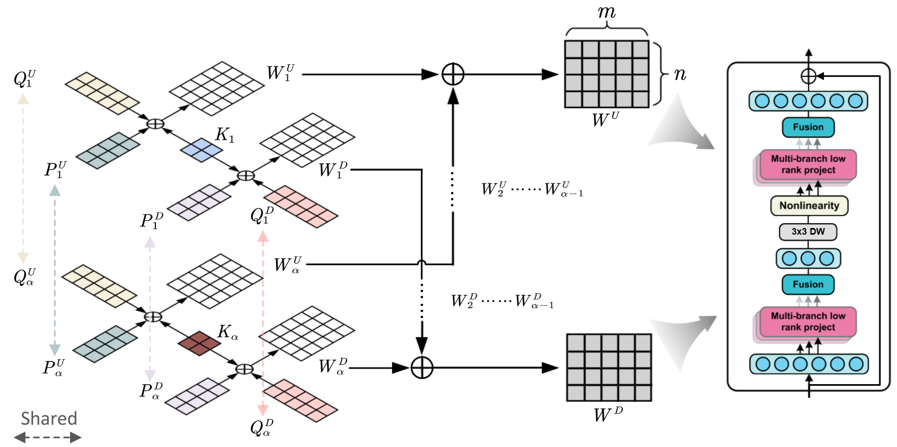

<div align="center">

## 🔥[arXiv] 1% > 100% : High-Efficiency Visual Adapter with Complex Linear Projection Optimization

### [arXiv homepage](xxx) |  [PDF]()



</div>


# Getting Started
## Object Detection & Instance Segmentation
### Installation
Please refer to [Swin-Transformer-Object-Detection](Swin-Transformer-Object-Detection/docs/get_started.md) for the 
environments and dataset preparation.

### Training CoLin

After organizing the dataset, you have to modify the config file according to your environments.
- `data_root`, have to be set as the actual dataset path.
- `load_from`, should be set to your pre-trained weight path.
- `norm_cfg`, have to be set to `SyncBN` if you train the model with multi-gpus.

Please execute the following command in the project path.
#### COCO
```shell
bash MMDetection/tools/dist_train.sh MMDetection/peft_configs/config/cascade_mask_rcnn_colin_train_only-b-p4-w7_official_3x_coco.py `Your GPUs`
```

#### VOC
```shell
bash MMDetection/tools/dist_train.sh MMDetection/peft_configs/config/retinanet_swin-l-p4-w7_fpn_1x_voc_colin_train_only.py `Your GPUs`
```


## Semantic Segmentation (TBD)


## Classification (TBD)


# Citation (TBD)
If our work is helpful for your research, please cite:

```angular2html

@article{yin20261,
  title={1\%\textgreater 100\%: High-Efficiency Visual Adapter with Complex Linear Projection Optimization},
  author={Yin, Dongshuo and Yang, Xue and Fan, Deng-Ping and Hu, Shi-Min},
  journal={arXiv preprint arXiv:2602.10513},
  year={2026}
}

```

```angular2html

@inproceedings{yin20255,
  title={5\%\textgreater 100\%: Breaking performance shackles of full fine-tuning on visual recognition tasks},
  author={Yin, Dongshuo and Hu, Leiyi and Li, Bin and Zhang, Youqun and Yang, Xue},
  booktitle={Proceedings of the Computer Vision and Pattern Recognition Conference},
  pages={20071--20081},
  year={2025}
}
```

```angular2html

@inproceedings{yin20231,
  title={1\% vs 100\%: Parameter-efficient low rank adapter for dense predictions},
  author={Yin, Dongshuo and Yang, Yiran and Wang, Zhechao and Yu, Hongfeng and Wei, Kaiwen and Sun, Xian},
  booktitle={Proceedings of the IEEE/CVF conference on computer vision and pattern recognition},
  pages={20116--20126},
  year={2023}
}
```

```angular2html

@inproceedings{yin2024parameter,
  title={Parameter-efficient is not sufficient: Exploring parameter, memory, and time efficient adapter tuning for dense predictions},
  author={Yin, Dongshuo and Han, Xueting and Li, Bin and Feng, Hao and Bai, Jing},
  booktitle={Proceedings of the 32nd ACM International Conference on Multimedia},
  pages={1398--1406},
  year={2024}
}
```

```angular2html

@article{hu2024airs,
  title={Airs: Adapter in remote sensing for parameter-efficient transfer learning},
  author={Hu, Leiyi and Yu, Hongfeng and Lu, Wanxuan and Yin, Dongshuo and Sun, Xian and Fu, Kun},
  journal={IEEE Transactions on Geoscience and Remote Sensing},
  volume={62},
  pages={1--18},
  year={2024},
  publisher={IEEE}
}
```


