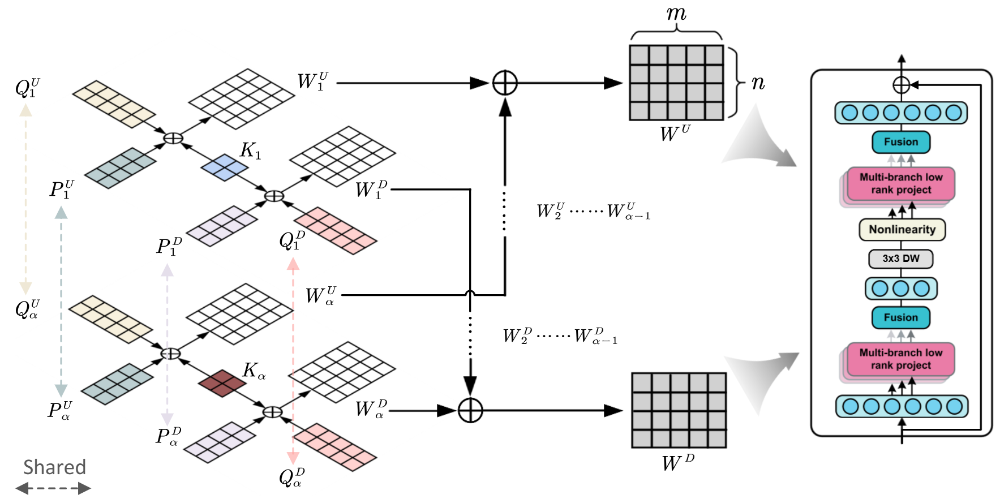

<div align="center">

## 1% > 100% : High-Efficiency Visual Adapter with Complex Linear Projection Optimization




</div>


# Getting Started
## Object Detection & Instance Segmentation
### Installation
Please refer to [Swin-Transformer-Object-Detection](Swin-Transformer-Object-Detection/docs/get_started.md) for the 
environments and dataset preparation.

### Training CoLin

After organizing the dataset, you have to modify the config file according to your environments.
- `data_root`, have to be set as the actual dataset path.
- `load_from`, should be set to your pre-trained weight path.
- `norm_cfg`, have to be set to `SyncBN` if you train the model with multi-gpus.

Please execute the following command in the project path.
#### COCO
```shell
bash MMDetection/tools/dist_train.sh MMDetection/peft_configs/config/cascade_mask_rcnn_colin_train_only-b-p4-w7_official_3x_coco.py `Your GPUs`
```

#### VOC
```shell
bash MMDetection/tools/dist_train.sh MMDetection/peft_configs/config/retinanet_swin-l-p4-w7_fpn_1x_voc_colin_train_only.py `Your GPUs`
```


